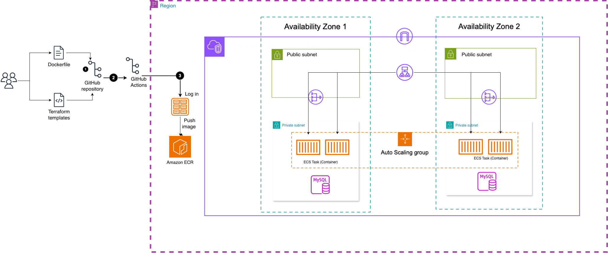

# Franchise Management System

Sistema de gestión de franquicias construido con el plugin [Scaffold Clean Architecture de Bancolombia](https://bancolombia.github.io/scaffold-clean-architecture/), programación funcional reactiva y desplegado en AWS.

El proyecto fue generado usando el plugin de Gradle `co.com.bancolombia.cleanArchitecture`, que proporciona una estructura base siguiendo los principios de Clean Architecture y Hexagonal Architectura.

## Tabla de Contenidos

- [Tecnologías](#tecnologías)
- [Arquitectura](#arquitectura)
- [Estructura del Proyecto](#estructura-del-proyecto)
- [Pre-requisitos](#pre-requisitos)
- [Configuración Local](#configuración-local)
- [Ejecución Local](#ejecución-local)
- [API Endpoints](#api-endpoints)
- [Docker](#docker)
- [Infraestructura AWS](#infraestructura-aws)
- [Base de Datos](#base-de-datos)
- [Testing](#testing)

## Tecnologías

### Backend
- **Java 21** - Lenguaje de programación
- **Spring Boot 4.0.1** - Framework base
- **Spring WebFlux** - Programación reactiva
- **R2DBC MySQL** - Driver reactivo para MySQL
- **Reactor Core 3.8.1** - Reactive Streams
- **Lombok** - Reducción de boilerplate
- **MapStruct** - Mapeo de objetos
- **SpringDoc OpenAPI 2.7.0** - Documentación API (Swagger)

### Build & Scaffolding
- **Gradle 8.x** - Sistema de construcción
- **[Scaffold Clean Architecture Plugin](https://bancolombia.github.io/scaffold-clean-architecture/) 4.0.5** - Plugin de Bancolombia para generación de estructura Clean Architecture
- **JUnit 5** - Testing
- **Testcontainers** - Tests de integración con contenedores Docker

### Infrastructure
- **Terraform** - Infrastructure as Code
- **AWS RDS MySQL 8.0.45** - Base de datos
- **AWS VPC** - Red privada
- **AWS ECR** - Registro de contenedores Docker
- **AWS EC2** (Bastion) - Acceso seguro a base de datos
- **AWS Systems Manager** - Port forwarding sin SSH


### Principios Aplicados

-  **Clean Architecture** - Separación de responsabilidades
-  **Hexagonal Architecture** - Puertos y adaptadores
-  **Functional Reactive Programming** - Streams reactivos con Mono/Flux
-  **SOLID Principles** - Diseño orientado a objetos
-  **Lazy Evaluation** - Evaluación diferida con `Mono.defer()` y `Mono.fromSupplier()`
-  **Dependency Inversion** - Interfaces en el dominio

## Arquitectura

### Diagrama de Infraestructura AWS



La aplicación está desplegada en AWS con los siguientes componentes:

| Componente | Descripción |
|------------|-------------|
| **VPC** | Red privada virtual con subnets públicas y privadas en 2 AZs |
| **RDS MySQL** | Base de datos en subnet privada (sin acceso público directo) |
| **ECR** | Registro de contenedores Docker para las imágenes de la aplicación |
| **NAT Gateway** | Permite salida a internet desde las subnets privadas |
| **Bastion Host** | EC2 con Session Manager para acceso seguro a RDS (sin SSH keys) |
| **S3 + DynamoDB** | Backend remoto para el state de Terraform |


### Módulos Gradle

| Módulo | Tipo | Descripción |
|--------|------|-------------|
| `:model` | Domain | Entidades de dominio e interfaces de repositorio |
| `:usecase` | Domain | Casos de uso (lógica de negocio) |
| `:mysql` | Infrastructure | Implementación de repositorios con R2DBC MySQL |
| `:reactive-web` | Infrastructure | Controladores REST con WebFlux |

## Pre-requisitos

### Para desarrollo local

1. **Java 21**
   ```bash
   brew install openjdk@21
   ```

2. **Gradle 8.x** (incluido con wrapper)
   ```bash
   ./gradlew --version
   ```

3. **MySQL Server** (base de datos local para desarrollo)
   ```bash
   brew install mysql
   brew services start mysql
   ```

4. **MySQL Client** (opcional, para administrar la base de datos)
   ```bash
   brew install mysql-client
   ```

### Para gestión de infraestructura AWS

5. **AWS CLI**
   ```bash
   brew install awscli
   aws configure
   ```

6. **Session Manager Plugin** (para túnel SSM hacia RDS)
   ```bash
   brew install --cask session-manager-plugin
   ```

7. **Terraform**
   ```bash
   brew install terraform
   ```

8. **Docker** (para construir imágenes)
   ```bash
   brew install --cask docker
   ```

## ⚙️ Configuración Local

### 1. Clonar el repositorio

```bash
git clone <repository-url>
cd Service-franchise
```

### 2. Configurar base de datos local

Para desarrollo local se usa **MySQL instalado en tu máquina**. Los defaults del `application.yaml` ya apuntan a `localhost:3306` con usuario `root`.

Crea la base de datos y carga el schema:

```bash
mysql -u root -p -e "CREATE DATABASE IF NOT EXISTS franchises_db"
mysql -u root -p franchises_db < applications/app-service/src/main/resources/schema.sql
```

Configura la contraseña de tu MySQL local como variable de entorno:

```bash
export DB_PASSWORD=TuPasswordLocal
```

### 3. Variables de entorno

La aplicación usa variables de entorno para las credenciales (nunca hardcodeadas).  
Copia el archivo de ejemplo y llénalo con tus valores:

```bash
cp .env.example .env
# Edita .env con tus credenciales
```

O expórtalas manualmente:

```bash
export DB_PASSWORD=TuPasswordLocal
```

Para desarrollo local solo es necesario configurar `DB_PASSWORD`, ya que los demás valores tienen defaults que apuntan a MySQL local:

| Variable | Default | Descripción |
|----------|---------|-------------|
| `DB_HOST` | `localhost` | Host de MySQL |
| `DB_PORT` | `3306` | Puerto de MySQL |
| `DB_NAME` | `franchises_db` | Nombre de la base de datos |
| `DB_USERNAME` | `root` | Usuario de MySQL |
| `DB_PASSWORD` | *(vacío)* | Contraseña (requerida, nunca en código) |

## Ejecución Local

### Compilar el proyecto

```bash
./gradlew clean build -x test
```

### Ejecutar la aplicación

**Opción 1: Con Gradle**

```bash
./gradlew :applications:app-service:bootRun
```

**Opción 2: Con JAR**

```bash
java -jar applications/app-service/build/libs/app-service.jar
```

La aplicación estará disponible en:
- **API**: http://localhost:8080
- **Swagger UI**: http://localhost:8080/webjars/swagger-ui/index.html

### Verificar que funciona

```bash
# Health check
curl http://localhost:8080/actuator/health

# Crear una franquicia
curl -X POST http://localhost:8080/api/franchises \
  -H "Content-Type: application/json" \
  -d '{"name": "Starbucks"}'
```

## API Endpoints

### Franchises

| Método | Endpoint | Descripción |
|--------|----------|-------------|
| POST | `/api/franchises` | Crear franquicia |
| PATCH | `/api/franchises/{franchiseId}/name` | Actualizar nombre de franquicia |
| GET | `/api/franchises/{franchiseId}/max-stock-products` | Obtener productos con mayor stock por sucursal |

### Branches

| Método | Endpoint | Descripción |
|--------|----------|-------------|
| POST | `/api/branches` | Agregar sucursal a franquicia |
| PATCH | `/api/branches/{branchId}/name` | Actualizar nombre de sucursal |

### Products

| Método | Endpoint | Descripción |
|--------|----------|-------------|
| POST | `/api/products` | Agregar producto a sucursal |
| DELETE | `/api/products/{productId}` | Eliminar producto |
| PATCH | `/api/products/{productId}/stock` | Actualizar stock de producto |
| PATCH | `/api/products/{productId}/name` | Actualizar nombre de producto |


Documentación completa en: http://localhost:8080/webjars/swagger-ui/index.html

## Docker

El proyecto está completamente dockerizado para facilitar el despliegue en cualquier entorno.

### Build local

**Multi-stage build:**
```bash
cd deployment
./build-image.sh latest
```

Esto crea una imagen optimizada usando multi-stage build (compile + runtime).

**Build manual (si ya tienes el JAR):**
```bash
# 1. Compilar JAR
./gradlew :applications:app-service:build -x test

# 2. Build imagen
docker build -f deployment/Dockerfile -t franchise-service:latest .
```

### Ejecutar con Docker

**Opción 1: Solo la app (requiere MySQL externo)**
```bash
docker run -p 8080:8080 \
  -e SPRING_R2DBC_URL=r2dbc:mysql://host.docker.internal:3306/franchises_db \
  -e SPRING_R2DBC_USERNAME=root \
  -e SPRING_R2DBC_PASSWORD=$DB_PASSWORD \
  franchise-service:latest
```

**Opción 2: App + MySQL con docker-compose (desarrollo local)**
```bash
cd deployment
docker-compose up -d
```

Esto levanta:
- **franchise-api**: La aplicación en http://localhost:8080
- **mysql**: Base de datos MySQL con schema pre-cargado

Para detener:
```bash
docker-compose down
```

### Push a AWS ECR

**Proceso completo (build + push):**
```bash
cd deployment
./deploy-docker.sh v1.0.0
```

**Paso a paso manual:**
```bash
# 1. Build
./build-image.sh v1.0.0

# 2. Push a ECR
./push-to-ecr.sh v1.0.0 us-east-1
```

**Verificar imagen en ECR:**
```bash
aws ecr describe-images \
  --repository-name franchise-service \
  --region us-east-1
```

### Características del Dockerfile

-  **Multi-stage build** - Imagen final solo con JRE (más pequeña)
-  **Usuario no-root** - Seguridad mejorada
-  **Health check** integrado


**Tamaño de imagen:**
- Stage 1 (builder): ~800MB (con Gradle y JDK)
- Stage 2 (final): ~200MB (solo JRE + app)

## Infraestructura AWS

La infraestructura está completamente definida como código con Terraform.

### Recursos desplegados

- **VPC** con subnets públicas y privadas
- **RDS MySQL 8.0.45** en subnet privada (sin acceso público)
- **NAT Gateway** para salida a internet desde subnets privadas
- **EC2 Bastion** con Systems Manager (sin SSH keys)
- **ECR Repository** para imágenes Docker
- **S3 + DynamoDB** para remote state de Terraform

### Desplegar infraestructura

```bash
cd infra

# Inicializar Terraform
terraform init

# Ver cambios
terraform plan

# Aplicar cambios
terraform apply
```

### Destruir infraestructura

```bash
cd infra
terraform destroy
```

**⚠️ ADVERTENCIA**: Esto eliminará todos los recursos y la base de datos.

## Base de Datos

### Schema

La base de datos tiene 3 tablas principales:

```sql
franchises (id, name, created_at, updated_at)
    ↓
branches (id, name, franchise_id, created_at, updated_at)
    ↓
products (id, name, stock, branch_id, created_at, updated_at)
```

### Inicializar schema en MySQL local (desarrollo)

```bash
mysql -u root -p -e "CREATE DATABASE IF NOT EXISTS franchises_db"
mysql -u root -p franchises_db < applications/app-service/src/main/resources/schema.sql
```

### Inicializar schema en RDS (AWS remoto)

Para crear el schema en la base de datos RDS en AWS, se usa un **túnel SSM** a través del Bastion Host. Esto permite conectarse a la base de datos privada sin exponer puertos públicos.

```bash
# Terminal 1: Iniciar túnel SSM hacia RDS
cd infra
./connect-mysql.sh
# Esto crea un túnel desde localhost:3307 → RDS en la subnet privada

# Terminal 2: Cargar el schema en RDS
mysql -h 127.0.0.1 -P 3307 -u admin -p < applications/app-service/src/main/resources/schema.sql
```

También puedes conectarte manualmente para verificar o administrar la base de datos remota:

```bash
mysql -h 127.0.0.1 -P 3307 -u admin -p
```

### Configuración de la aplicación

La aplicación se conecta automáticamente usando las variables de entorno configuradas en `application.yaml`:

```yaml
spring:
  r2dbc:
    url: r2dbc:mysql://${DB_HOST:localhost}:${DB_PORT:3306}/${DB_NAME:franchises_db}
    username: ${DB_USERNAME:root}
    password: ${DB_PASSWORD:}
```

> **Nota:** En desarrollo local la app usa los defaults (`localhost:3306`, `root`). En producción (AWS), las variables de entorno se configuran en el servicio desplegado para apuntar a RDS.

## Testing

```bash
# Ejecutar todos los tests
./gradlew test

# Ejecutar tests con reporte
./gradlew test jacocoTestReport

# Ver reporte de cobertura
open build/reports/jacoco/test/html/index.html
```

## 📝 Notas Importantes

### Programación Funcional Reactiva

El proyecto usa programación reactiva con Reactor:

```java
// Buena práctica: Lazy evaluation
Mono.defer(() -> Mono.error(...))
Mono.fromSupplier(() -> pathVariable)

// Composición de operadores
repository.findById(id)
    .switchIfEmpty(Mono.defer(() -> Mono.error(...)))
    .flatMap(entity -> repository.update(...))
    .then(repository.findById(id))
```

### R2DBC vs JPA

Este proyecto usa **R2DBC** (reactivo), no JPA:

```java
// NO usar anotaciones JPA
@Entity  // NO
@Table   // NO

//  Usar anotaciones R2DBC
@Table("franchises")
@Id
private Long id;
```

### @Param requerido en queries

R2DBC requiere `@Param` para mapeo correcto:

```java
@Query("UPDATE franchises SET name = :name WHERE id = :id")
Mono<Integer> updateName(@Param("id") Long id, @Param("name") String name);
```

