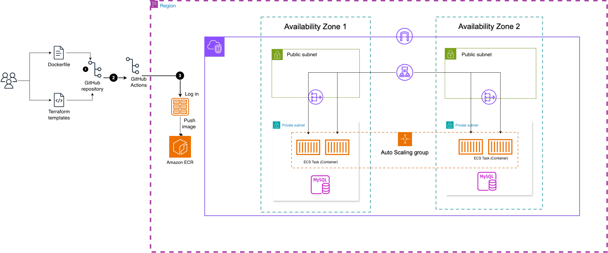

# Franchise Management System

API reactiva para gestión de franquicias, sucursales y productos. Construida con [Scaffold Clean Architecture de Bancolombia](https://bancolombia.github.io/scaffold-clean-architecture/), Spring WebFlux y R2DBC, desplegada en AWS con CI/CD automatizado.

## Arquitectura



| Capa | Módulo | Descripción |
|------|--------|-------------|
| Domain | `:model` | Entidades e interfaces de repositorio |
| Domain | `:usecase` | Lógica de negocio |
| Infrastructure | `:mysql` | Repositorios con R2DBC MySQL |
| Infrastructure | `:reactive-web` | Controladores REST (WebFlux) |

### Stack

- Java 21, Spring Boot 4.0.1, Spring WebFlux, R2DBC MySQL
- Gradle 8.x con [Scaffold Clean Architecture Plugin](https://bancolombia.github.io/scaffold-clean-architecture/)
- Terraform (IaC), Docker, GitHub Actions (CI/CD)
- AWS: VPC, ECS Fargate, ALB, RDS MySQL, ECR, Bastion Host (SSM)

## Ejecución local

### Pre-requisitos

- Java 21
- MySQL Server
- (Opcional) Docker, Terraform, AWS CLI

### Configurar base de datos

```bash
mysql -u root -p -e "CREATE DATABASE IF NOT EXISTS franchises_db"
mysql -u root -p franchises_db < applications/app-service/src/main/resources/schema.sql
```

### Variables de entorno

Solo `DB_PASSWORD` es requerida. Los demás valores tienen defaults para desarrollo local (`localhost:3306`, usuario `root`):

```bash
export DB_PASSWORD=tu_password
```

### Ejecutar

```bash
./gradlew :app-service:bootRun
```

La app estará en http://localhost:8080. Swagger UI en http://localhost:8080/webjars/swagger-ui/index.html.

### Tests

```bash
./gradlew test
```

## API Endpoints

Documentación completa en: http://localhost:8080/webjars/swagger-ui/index.html

### Franchises

| Método | Endpoint | Descripción |
|--------|----------|-------------|
| POST | `/api/franchises` | Crear franquicia |
| PATCH | `/api/franchises/{id}/name` | Actualizar nombre |
| GET | `/api/franchises/{id}/max-stock-products` | Productos con mayor stock por sucursal |

### Branches

| Método | Endpoint | Descripción |
|--------|----------|-------------|
| POST | `/api/branches` | Agregar sucursal a franquicia |
| PATCH | `/api/branches/{id}/name` | Actualizar nombre |

### Products

| Método | Endpoint | Descripción |
|--------|----------|-------------|
| POST | `/api/products` | Agregar producto a sucursal |
| DELETE | `/api/products/{id}` | Eliminar producto |
| PATCH | `/api/products/{id}/stock` | Actualizar stock |
| PATCH | `/api/products/{id}/name` | Actualizar nombre |

## CI/CD y Despliegue en AWS

El despliegue continuo se ejecuta automáticamente con **GitHub Actions** en cada push a `main` (o manualmente via `workflow_dispatch`).

### Pipeline (`.github/workflows/terraform-dev.yml`)

El workflow tiene 3 jobs secuenciales:

```
1. Infrastructure  →  2. Docker  →  3. Deploy
```

1. **Infrastructure**: Ejecuta `terraform apply` en `infra/` para crear/actualizar la infraestructura (VPC, RDS, ECS, ALB, ECR). Los outputs de Terraform (ECR URL, cluster name, etc.) se pasan a los siguientes jobs.

2. **Docker**: Compila la app con Gradle, construye la imagen Docker y la sube a ECR con tags `latest` y `sha` del commit.

3. **Deploy**: Fuerza un nuevo deployment en ECS (`aws ecs update-service --force-new-deployment`) y espera a que el servicio se estabilice.

### Conexión GitHub Actions ↔ AWS

La autenticación se hace con credenciales IAM almacenadas como **GitHub Secrets**:

| Secret | Descripción |
|--------|-------------|
| `AWS_ACCESS_KEY_ID` | Access key del usuario IAM |
| `AWS_SECRET_ACCESS_KEY` | Secret key del usuario IAM |
| `DB_MASTER_PASSWORD` | Contraseña de RDS (se pasa como `TF_VAR_db_master_password`) |

### Infraestructura (Terraform)

Los módulos de Terraform están en `infra/`:

| Módulo | Recursos |
|--------|----------|
| `networking` | VPC, subnets públicas/privadas, NAT Gateway, Internet Gateway |
| `rds` | RDS MySQL en subnet privada |
| `ecs` | ECS Fargate cluster, task definition, service, auto-scaling |
| `alb` | Application Load Balancer, target group, listener |
| `ecr` | Repositorio de imágenes Docker |
| `bastion` | EC2 con SSM para acceso seguro a RDS |

El state de Terraform se almacena en S3 con locking en DynamoDB.

### Gestión manual de infraestructura

```bash
cd infra
terraform init
terraform plan
terraform apply
```

### Acceso a RDS via Bastion (SSM)

Para conectarse a la base de datos RDS desde tu máquina local:

```bash
# Terminal 1: Iniciar túnel SSM
cd infra && ./connect-mysql.sh

# Terminal 2: Conectarse a RDS
mysql -h 127.0.0.1 -P 3307 -u admin -p
```

Requiere AWS CLI y el [Session Manager Plugin](https://docs.aws.amazon.com/systems-manager/latest/userguide/session-manager-working-with-install-plugin.html).
